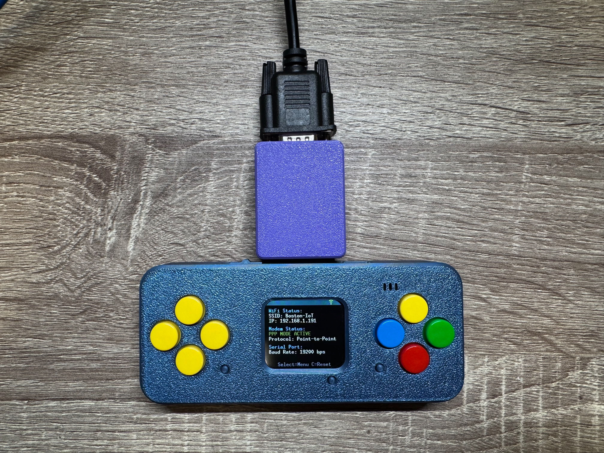
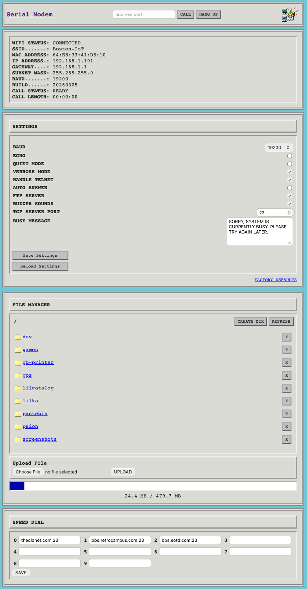

# Lilka Serial Modem

A Hayes-compatible WiFi modem for the Lilka ESP32-S3 handheld device. This firmware transforms your Lilka into a vintage WiFi modem, allowing classic computers to connect to the internet via WiFi using familiar AT commands through an RS232 serial connection.



## Features

### Core Modem Functionality
- **Hayes AT Command Set** - Complete modem command compatibility with industry-standard AT commands
- **TCP/Telnet Connections** - "Dial" IP addresses and ports instead of phone numbers (e.g., `ATDTbbs.example.com:23`)
- **Multiple Baud Rates** - Support for 300 to 115200 bps with real-time switching
- **Command/Data Mode Switching** - Standard `+++` escape sequence and `ATO` command
- **Telnet Protocol Support** - Full IAC handling for clean BBS and vintage service connections
- **TCP Server Mode** - Accept incoming connections with RING notifications
- **Auto-Answer Mode** - Automatic answer capability for BBS hosting (ATS0 command)

### Dial-Up Networking (PPP)
- **PPP Protocol Stack** - Point-to-Point Protocol implementation with LCP/IPCP negotiation
- **IP Routing Engine** - TCP/UDP/ICMP forwarding for internet access
- **Vintage Device Support** - Compatible with Windows 95/98 Dial-Up Networking, Psion 5MX, and other vintage systems with PPP capability
- **Automatic PPP Detection** - Dial 777 or send 0x7E frames directly to activate
- **DNS Configuration** - Automatic DNS server assignment using WiFi gateway

### WiFi Management
- **Easy Configuration** - SSID/password setup via AT commands or web interface
- **WiFi Scanner** - Interactive network scanner with password input
- **Auto-Connect** - Automatic connection to saved network on boot
- **Connection Monitoring** - Real-time status display with signal information

### User Interface
- **Visual Display** - Connection status, IP address, modem state, and PPP mode on Lilka screen
- **Native Menu System** - Full-featured menu using Lilka SDK (WiFi scanner, speed dial editor, settings)
- **Button Controls** - Quick hang up and menu access using Lilka buttons
- **Status Priority** - Display shows PPP mode status over TCP connections when active

### File Transfer & Storage
- **YMODEM Protocol** - Upload/download files to SD card with CRC-16 error checking
- **XMODEM Support** - Upload/download files to SD card
- **AT Commands** - List files (AT$LS), upload (AT$UL), and download (AT$DL) via serial
- **Web File Manager** - Full file management via browser (upload/download/delete/create folders/navigate)
- **Transfer Progress** - Real-time progress display during file operations

### Web Configuration
- **Web Interface** - Full-featured HTTP server for browser-based configuration
- **Real-Time Updates** - Server-Sent Events for live status monitoring
- **Speed Dial Editor** - Manage all 10 speed dial entries via web
- **Settings Management** - Configure all modem parameters remotely
- **API Endpoints** - JSON API for integration and automation

### Advanced Features
- **Settings Storage** - Configuration persists using ESP32 Preferences
- **Speed Dial** - Store up to 10 frequently used addresses (0-9)
- **HTTP GET Support** - Fetch web content and stream to serial port (ATGET command)
- **Custom Busy Message** - Set personalized message for rejected connections
- **Factory Reset** - Restore defaults with WiFi disconnect

## Hardware Requirements

### Lilka Device
- Lilka v2 console
- Extension header with TX/RX pins exposed

### RS232 Interface
You'll need RS232 - TTL converter based on MAX3232 or SP3232EEN chip to safely connect the modem to vintage computers

**Connections:**
```
Lilka Extension Header → RS232 - TTL converter 
TX (GPIO 43)           → RX
RX (GPIO 44)           → TX
GND                    → GND
3.3V                   → VCC
```

## Building the Firmware

### Prerequisites
- [PlatformIO](https://platformio.org/)
- USB connection to Lilka

### Build and Upload
```bash
cd oldnet-modem
platformio run --target upload
```

Or using the PlatformIO IDE in VS Code.

## Configuration

### First Time Setup

1. Connect to Lilka via RS232 (default: 9600 baud, 8N1)
2. Type `AT` to verify connection
3. Configure WiFi:
   ```
   AT$SSID=YourNetworkName
   AT$PASS=YourPassword
   ATC1              (connect to WiFi)
   ```

## AT Command Reference

### Basic Commands
- `AT` - Test modem response
- `AT?` or `ATHELP` - Show command summary
- `ATI` - Show device info (version, chip, WiFi status, IP, call status)
- `ATIP` - Show IP address and WiFi status
- `AT&V` - Show current settings (baud, SSID, flags, speed dials)
- `AT&F` - Factory reset (restore defaults)

### Connection Commands
- `ATDThost:port` - Dial host (e.g., `ATDTbbs.example.com:23`)
- `ATDS0-9` - Speed dial (use stored address)
- `ATA` - Answer incoming connection
- `ATH` - Hang up current connection
- `ATGEThttp://host/path` - HTTP GET request (streams response to serial)
- `+++` - Return to command mode (wait 1 second before/after)
- `ATO` - Exit command mode, return to online mode (resume connection)

### WiFi Commands
- `AT$SSID=name` - Set WiFi SSID
- `AT$PASS=password` - Set WiFi password
- `ATC0` - Disconnect from WiFi
- `ATC1` - Connect to WiFi

### File System Commands
- `AT$LS` - List all files and folders on SD card
  - Recursive directory traversal
  - Shows file sizes in human-readable format (B, KB, MB, GB)
  - Displays folder structure with indentation
  - Shows SD card usage statistics
- `AT$UL` - Upload file to SD card using YMODEM protocol
  - Modem sends 'C' to initiate CRC mode
  - Sender transmits filename and size in block 0
  - File saved to SD card (root or subdirectory)
  - Automatic error recovery with CRC-16 checking
  - Works with terminal software supporting YMODEM send (Tera Term, HyperTerminal, minicom)
  - Echo automatically disabled during transfer
- `AT$DL=/path/filename` - Download file from SD card using YMODEM protocol
  - Specify full path: `AT$DL=/logs/system.log` or `AT$DL=/test.txt`
  - Modem waits for receiver to send 'C' (ready signal)
  - Transmits file with CRC-16 error checking
  - Terminal software must support YMODEM receive
  - 60 second timeout for transfer start, 10 second timeout per block

**YMODEM File Transfer Setup:**

For reliable file transfers, use **19200 baud**:
```
AT$SB=19200    (set baud rate)
```

Higher baud rates (38400, 57600) may experience transmission errors depending on your RS232 hardware and cable quality. 19200 baud provides stable transfers with good throughput (~1.9 KB/s).

**Terminal Software for File Transfers:**

**Windows:**
- **Tera Term** (free, recommended) - File → Transfer → YMODEM → Send/Receive
- **HyperTerminal** (Windows 95/98/XP) - Transfer → Send/Receive File → YMODEM
- **ExtraPutty** (PuTTY fork with YMODEM support)

**macOS/Linux:**
- **CoolTerm** (macOS, free) - Connection → Send/Receive Files
- **minicom** with YMODEM support: `minicom -D /dev/ttyUSB0 -b 19200`
  - Press Ctrl+A, then S (send) or R (receive)
  - Select YMODEM protocol
- **screen** with sz/rz commands: `screen /dev/ttyUSB0 19200`
  - Press Ctrl+A, then `:exec !! sz filename` (send)
  - Press Ctrl+A, then `:exec !! rz` (receive)

**YMODEM Protocol Details:**
- Block size: 128 bytes (SOH mode)
- Error checking: CRC-16 (CRC-CCITT, polynomial 0x1021)
- Retry limit: 10 consecutive errors per block
- Block 0: Contains filename and file size metadata
- Session termination: EOT followed by null block 0
- Maximum file size: Limited only by SD card capacity
- Recommended baud rate: 19200 for reliable transfers

### Settings Commands
- `ATE0` / `ATE1` - Echo off/on (local echo of typed characters)
- `ATV0` / `ATV1` - Verbose responses off/on (text vs numeric result codes)
- `ATQ0` / `ATQ1` - Quiet mode off/on (suppress all result codes)
- `ATNET0` / `ATNET1` - Telnet protocol off/on (IAC handling, 0xFF escaping)
- `AT$SB=rate` - Set baud rate (300-115200, takes effect immediately)
- `AT$BM=message` - Set busy message (max 100 chars, shown to rejected callers)
- `AT$BM?` - Query current busy message
- `AT$BUZZ=0` / `AT$BUZZ=1` - Buzzer sounds off/on (ring tone)
- `AT$BUZZ?` - Query current buzzer setting
- `ATS0=0` / `ATS0=1` - Auto-answer off/on (manual ATA vs automatic answer)
- `ATS0?` - Query auto-answer setting
- `AT&ZN=host:port` - Set speed dial N (0-9)
- `ATZ` - Reload settings from storage
- `AT&F` - Factory reset to defaults

**Note about modes:**
- **Echo (E)**: Controls if typed characters are echoed back to terminal
- **Verbose (V1)**: Result codes as text (`OK`, `CONNECT 9600`, `ERROR`)
- **Verbose (V0)**: Result codes as numbers (`0`, `1`, `4`)
- **Quiet (Q1)**: Suppresses all result codes (silent mode)
- **Telnet (NET1)**: Filters telnet control codes for clean BBS connections
- **Telnet (NET0)**: Raw TCP mode, passes all bytes unchangedge
- `AT&F` - Factory reset to defaults

### Result Codes
```
0 - OK
1 - CONNECT
2 - RING
3 - NO CARRIER
4 - ERROR
6 - NO DIALTONE
7 - BUSY
8 - NO ANSWER
```

## Display Interface

The Lilka display shows:
- **WiFi Status** - Connection state, SSID, IP address
- **Modem Status** - Multiple priority modes:
  - **"UPLOADING FILE..."** / **"DOWNLOADING FILE..."** (yellow) - File transfer in progress via YMODEM, shows filename
  - **"PPP MODE ACTIVE"** (green) - PPP connection established, IP routing active
  - **"NEGOTIATING PPP..."** (yellow) - PPP mode enabled, waiting for first frame or negotiating
  - **"CONNECTED"** (green) - TCP connection active, shows remote host and duration
  - **"Ready (Command Mode)"** (yellow) - Idle, ready for AT commands
- **Serial Settings** - Current baud rate and port configuration
- **Button Hints** - Available quick actions

The display prioritizes PPP status over TCP connections, ensuring you always know when dial-up networking is active.

### Button Controls
- **Button Select** - Show configuration menu
- **Button C** - Hang up current connection

### Configuration Menu

Press **Select** button to access the interactive menu:

- **WiFi Scanner** - Scan and connect to networks with password input
- **Speed Dials** - Edit 10 speed dial entries (0-9)
- **Settings** - Configure all modem parameters:
  - Baud rate (300-115200)
  - Echo mode (local character echo)
  - Verbose mode (text vs numeric responses)
  - Telnet mode (IAC filtering)
  - Auto answer (automatic ATA)
  - **Buzzer** (ring tone on/off)
  - **Busy message** (custom rejection message) 
  - **Server port** (TCP listening port)
- **About** - View version and credits

## Web Configuration Interface

When connected to WiFi, access the web interface at:
- **http://[modem-ip-address]**

The IP address is shown on the Lilka display and via the `ATI` command.



### Features
- **Real-Time Status Monitoring** - Live updates on modem status, connection info, and call duration
- **Modem Control** - Dial and hang up directly from browser
- **Settings Management** - Configure all modem parameters via web form
- **Speed Dial Editor** - Edit all 10 speed dial entries
- **SD Card File Manager**
  - Browse folders with navigation
  - Upload files to any directory
  - Download files
  - Delete files and folders
  - Create new folders
  - SD card usage display with progress bar
- **Factory Reset** - Restore defaults and disconnect WiFi

### Web API Endpoints

**Status & Configuration:**
- `GET /` - Web interface HTML page
- `GET /get-settings` - JSON settings (all modem parameters)
- `GET /get-speeddials` - JSON array of speed dial entries
- `/events` - Server-Sent Events (SSE) stream for real-time status updates (persistent connection, pushes updates every 2 seconds)

**Modem Control:**
- `POST /dial` - Dial host (param: address)
- `POST /ath` - Hang up
- `POST /save-settings` - Update modem settings
- `POST /reload-settings` - Reload from storage
- `POST /update-speeddial` - Update speed dial entries
- `POST /factory-defaults` - Factory reset

**File Manager:**
- `GET /list-files?path=/folder` - List files and folders in directory (returns JSON with file metadata)
- `POST /upload-file?path=/folder` - Upload file to specified directory
- `GET /download-file?path=/folder/file.txt` - Download file
- `POST /delete-file` - Delete file or folder (recursive for folders)
- `POST /create-folder` - Create new directory
- `GET /download-log` - Download modem.log file

Access the web interface by visiting the modem's IP address shown on the display or via `ATI` command.

## Example Session

```
AT
OK

ATI
VENDOR.....: Anderson & friends
MODEL......: Lilka v2
VERSION....: 1.0 (20260316)
CHIP MODEL.: ESP32-S3
CPU FREQ...: 240 MHz
FREE MEMORY: 245 KB
FLASH SIZE.: 8 MB
WIFI STATUS: CONNECTED
SSID.......: MyHomeNetwork
MAC ADDRESS: 48:55:19:00:39:67
IP ADDRESS.: 192.168.1.100
GATEWAY....: 192.168.1.1
SUBNET MASK: 255.255.255.0
SERVER PORT: 23
WEB CONFIG.: HTTP://192.168.1.100
CALL STATUS: NOT CONNECTED
OK

AT&V
BAUD: 9600
SSID: MyHomeNetwork
E1 Q0 V1 FK0 NET1 S0:0 BUZZ1
BUSY MSG: SORRY, SYSTEM IS CURRENTLY BUSY. PLEASE TRY AGAIN LATER.
SPEED DIAL:
0: theoldnet.com:23
1: bbs.retrocampus.com:23
2: bbs.eotd.com:23
3: 
4: 
5: 
6: 
7: 
8: 
9: 
OK

ATDTtowel.blinkenlights.nl:23
DIALING towel.blinkenlights.nl:23

CONNECT 9600

[... Star Wars ASCII animation plays ...]

+++
OK

ATH
NO CARRIER (00:05:23)

ATGEThttp://example.com
HTTP GET: http://example.com
Connecting...
Receiving...

CONNECT 9600
HTTP/1.1 200 OK
Content-Type: text/html
...
<html>...</html>

(Response streams to terminal - use terminal capture or vintage computer software to save)
```

## PPP Dial-Up Networking

The modem supports complete PPP (Point-to-Point Protocol) for dial-up networking from vintage computers. This allows Windows 95/98, Psion 5MX, and other vintage systems to browse the internet through the modem.

### Quick Start

**Automatic Method (Recommended):**
1. Configure Windows 95 Dial-Up Networking (see detailed guide below)
2. Set phone number to `777` 
3. Click "Connect"
4. PPP mode activates automatically
5. Start browsing!

**Direct Connection Method:**
1. Configure PPP client for serial port connection
2. Client dials `ATDT777` or sends PPP frames directly (0x7E)
3. Modem auto-detects and enables PPP mode
4. Start using internet applications

### Features

- **Complete IP Routing**: Full TCP/UDP/ICMP forwarding
- **LCP/IPCP**: Standard PPP negotiation
- **DNS Support**: Automatic DNS server configuration (uses WiFi gateway)
- **IP Assignment**: Assigns 192.168.7.2 to client
- **Auto-Detection**: Recognizes PPP frames (0x7E) and activates automatically
- **Status Display**: Shows "PPP MODE ACTIVE" or "NEGOTIATING PPP..." on screen
- **Performance**: Optimized for 9600 baud, supports higher speeds

### Tested Platforms

- ✅ **Windows 95**
- ✅ **Psion 5MX**

### Limitations

- No authentication (PAP/CHAP) - all connections accepted
- Single client only
- Best performance at 9600 baud

---

## Windows 95 PPP Setup Guide

### Prerequisites
- Windows 95 with Dial-Up Networking installed
- Null modem cable or RS-232 cable connecting PC to Lilka modem
- Note which COM port the cable is connected to (COM1, COM2, etc.)

### Step-by-Step Configuration

**1. Install Dial-Up Networking (if not already installed)**
- Go to Control Panel → Add/Remove Programs → Windows Setup
- Select "Communications" → Details
- Check "Dial-Up Networking" → OK → OK
- Restart if prompted

**2. Create a New Connection**
- Open "My Computer" → "Dial-Up Networking"
- Double-click "Make New Connection"
- Connection name: `Lilka Modem` (or any name you prefer)
- Select device: Choose any modem that allows COM port selection, or `Standard Modem`
  - If no suitable modem appears, you may need to install one:
    - Control Panel → Modems → Add
    - Check "Don't detect my modem; I will select it from a list"
    - Select "Standard Modem Types" → "Standard 9600 bps Modem"
    - Select your COM port (COM1, COM2, etc.)
- Click Next

**3. Phone Number (if prompted)**
- Enter: `777` (this special number activates PPP mode automatically)
- Click Next → Finish

**4. Configure Modem Properties (Important!)**
- Go to Control Panel → Modems
- Select your modem → Properties
- **General tab:**
  - Maximum speed: `9600` (or higher if you changed baud with AT$SB=)
- **Connection tab:**
  - Port Settings:
    - Bits per second: `9600`
    - Data bits: `8`
    - Parity: `None`
    - Stop bits: `1`
  - Advanced:
    - Uncheck "Use error control"
    - Uncheck "Compress data"
  - Uncheck "Wait for dial tone before dialing"
- Click OK

**5. Configure Connection Properties**
- Right-click the new connection icon → Properties
- **General tab:**
  - Phone number: Leave as `1` (ignored by PPP)
  - Uncheck "Use country code and area code"
- **Server Types tab:**
  - Type of Dial-Up Server: `PPP: Internet, Windows NT Server, Windows 98`
  - Advanced options: Uncheck ALL boxes:
    - Uncheck "Log on to network"
    - Uncheck "Enable software compression"
    - Uncheck "Require encrypted password"
  - Allowed network protocols: Check ONLY `TCP/IP`
    - Uncheck NetBEUI
    - Uncheck IPX/SPX Compatible
  - Click "TCP/IP Settings" button:
    - Select "Server assigned IP address"
    - Select "Server assigned name server addresses"
    - Uncheck "Use IP header compression"
    - Uncheck "Use default gateway on remote network" (optional - check if you want all traffic through modem)
    - Click OK
- Click OK to save all settings

**6. Connect**
- Simply double-click your "Lilka Modem" connection
- Click "Connect"
- Windows will dial "777" which automatically activates PPP mode on the modem
- LCP/IPCP negotiation happens automatically
- Connection should establish within seconds
- The Lilka display will show "NEGOTIATING PPP..." then "PPP MODE ACTIVE"

**7. Verify Connection**
- Look for connection icon in system tray
- Right-click → Status to see connection details
- IP address should be: `192.168.7.2`
- Try pinging (Start → Run → `command.com`):
  ```
  ping 192.168.7.1
  ping 8.8.8.8
  ```
- **Internet browsing now works!** Open Internet Explorer or Netscape Navigator
- Try browsing: `http://www.frogfind.com` or `http://theoldnet.com`

### Troubleshooting

**"The computer is not receiving a response from the modem" (Most Common Issue):**

**"The computer is not receiving a response from the modem":**

This error should no longer occur with automatic PPP activation (dialing 777). If you still see it:

- Verify the phone number is set to `777` in your Dial-Up connection
- Check that the correct COM port is selected  
- Verify baud rate is 9600 (or matches modem setting)
- Make sure no other program is using the COM port

**Debug Method: Check what's happening**

The modem outputs debug logs via USB (when PPP_LOG_LEVEL=1 in code). To see detailed PPP activity:

1. Keep Lilka connected to USB while also connected to Windows via RS232
2. Open PlatformIO Serial Monitor (115200 baud)
3. Try connecting from Windows
4. You should see PPP negotiation messages (if logging enabled)

**Note:** By default, PPP logging is disabled for performance (PPP_LOG_LEVEL=0). This dramatically improves speed. Enable logging only for troubleshooting.

**Direct PPP Frames:**

Some PPP clients (like Psion 5MX) send PPP frames directly without dialing:
1. Configure PPP client for direct serial connection
2. Client sends PPP frames (starting with 0x7E)
3. Modem auto-detects frames and enables PPP mode
4. No AT commands needed

**Note:** Windows Dial-Up Networking should always dial 777. If you see "Dialing..." for too long, verify the phone number is set to "777" in your connection properties.

**Connection fails at "Verifying username and password":**
- Make sure "Log on to network" is UNCHECKED in Server Types
- Authentication is not supported yet

**"No dial tone" error:**
- In Modem Properties, uncheck "Wait for dial tone"
- Or add to initialization string: `ATX3` (ignore dial tone)

**"No carrier" or immediate disconnect:**
- Verify baud rates match between Windows and modem (default 9600)
- Check that phone number is set to "777" in Dial-Up connection
- Make sure no other program is using the COM port
- Verify RS232 cable connections
- For higher speeds (9600+), use AT$SB=9600 before connecting

**Wrong COM port:**
- Check Device Manager (Control Panel → System → Device Manager)
- Look under "Ports (COM & LPT)" to see which COM ports exist
- Test each port until you find the right one

**Cannot see "Direct Cable Connection":**
- This is normal - "Direct Cable Connection" is a separate Windows 95 feature, not a modem type
- Use "Standard Modem" or "Standard 9600 bps Modem" instead
- The key is selecting a modem that allows you to configure the COM port

### Alternative: Using HyperTerminal to Test

Before setting up Dial-Up Networking, test basic modem functionality:

1. Open HyperTerminal
2. Connect to COM port at 9600 baud, 8-N-1
3. Type `AT` - should respond `OK`
4. Type `ATI` - shows modem info and WiFi status
5. Type `ATDT777` - should respond `CONNECT 9600` and enable PPP mode
6. Close HyperTerminal
7. Then connect from Windows Dial-Up Networking

**Note:** PPP activates automatically when dialing 777 or when receiving PPP frames (0x7E).

## Server Mode Example
```
ATS0=0          (manual answer mode - requires ATA command)
AT$BM=BBS IS BUSY - TRY AGAIN IN 5 MINUTES
OK
AT$BUZZ=1       (enable buzzer sounds)
OK

[Remote user connects via telnet]
RING            (with buzzer sound)
RING
ATA
CONNECT 9600

[Chat or transfer data]

+++
OK
ATH
NO CARRIER (00:02:15)
```

## Supported Baud Rates

- 300 bps
- 1200 bps
- 2400 bps
- 4800 bps
- 9600 bps (default)
- 19200 bps
- 38400 bps
- 57600 bps
- 115200 bps

## Troubleshooting

### No Response from Modem
- Check RS232 connections
- Verify baud rate matches (default: 9600)
- Ensure RS232 level shifter has power
- Try pressing reset on Lilka

### Cannot Connect to WiFi
- Check WiFi signal strength
- Use `ATC1` to manually connect
- View display for connection status
- Use menu system (Select button) to scan and connect to networks

### Connection Drops
- Check WiFi stability
- Verify host is still responsive
- Use `ATNET1` to enable telnet protocol handling

### Wrong Voltage Levels
- Lilka uses 3.3V logic - always use MAX3232/MAX232/SP3232EEN level shifter

## Technical Details

### Architecture
- **Platform**: ESP32-S3 (PlatformIO)
- **Framework**: Arduino
- **Storage**: ESP32 Preferences (NVS) - auto-save on all changes
- **Display**: 240x320 TFT via Lilka SDK
- **Serial**: UART1 on extension header TX/RX pins
- **Web Server**: ESPAsyncWebServer
- **Networking**: WiFiClient, WiFiServer for TCP connections

### Pin Mapping
```c
#define MODEM_TX_PIN 43  // TX on extension header
#define MODEM_RX_PIN 44  // RX on extension header
```

## Credits

Inspired by the original [vintage-computer-wifi-modem](https://github.com/ssshake/vintage-computer-wifi-modem) project.

## License

GNU General Public License v3.0 (GPLv3)

## Links

- [Lilka](https://lilka.dev)
- [TheOldNet Project](https://theoldnet.com/)
- [Vintage Computer WiFi Modem](https://github.com/ssshake/vintage-computer-wifi-modem)
